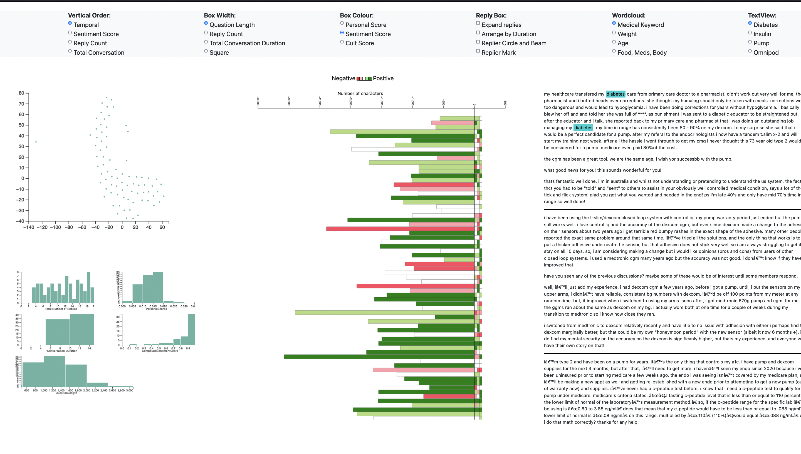

# OHCVisualization

## 1. Introduction
* Online Health Communities (OHC) are made up of community people who require support on a range of health issues and related subjects as well as health specialists. Caretakers can help moderate discussion threads and reply to any questions members may have through such groups. Since this is an online group, spreading incorrect information is simple, and it takes a lot of time and effort to monitor such interactions. The analytics that are currently available around these health communities only provide data on the group's quantitative characteristics, such as the number of members. We lack a visible method to determine the nature of the dialogues taking place in these threads. In order to understand the key points of the discussion, health experts typically read each thread. This project aims to build visualization solutions to facilitate effective conversations between members and care-givers. 

## 2. Visualization Dashboard
 
